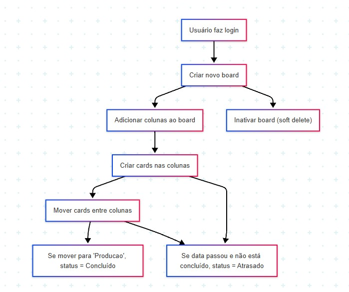

# afl-kanban-api

## Overview

The `afl-kanban-api` is a RESTful API designed to manage a kanban board system. It is built using Django and Django REST Framework, providing endpoints for managing boards, columns, and cards.

## Features & Business Rules

- **User Authentication:** Only authenticated users can access and manage their boards, columns, and cards.
- **Board Management:** Users can create, view, update, inactivate (soft delete), and list their own boards.
- **Column Management:** Boards can have multiple columns, each with a customizable order. Columns can be reordered, and the system ensures no duplicate order values within a board.
- **Card Management:** Cards belong to columns, have a title, delivery date, status, assignee, and order (position). Cards can be moved between columns and reordered within columns.
- **Card Status Automation:**  
  - When a card is created, its status is always set to `on_time` and the assignee is the user who created it.
  - If the delivery date passes and the card is not marked as `done`, its status automatically becomes `late` in API responses.
  - Cards moved to a column named "produção" are automatically marked as `done`.
  - Cards with status `done` cannot be moved or edited.
- **Soft Delete for Boards:** Deleting a board only marks it as inactive (`active = False`), preserving data integrity.
- **Order Management:**  
  - When a new card is created in a column, it is placed at the top (order=1), and all other cards in that column have their order incremented.
  - When reordering columns or cards, the system swaps order values to avoid duplicates.

## Example Usage & System Flow



1. **User logs in** using their credentials.
2. **User creates a new board** (e.g., "Projeto X").
3. **User adds columns** to the board (e.g., "Backlog", "Em andamento", "Produção").
4. **User creates cards** in columns, specifying title and delivery date. The card is assigned to the user and appears at the top of the column.
5. **User drags cards** between columns or reorders them within a column. The backend updates the order and status as needed.
6. **If a card is moved to "Produção"**, its status becomes `done` and it cannot be moved or edited further.
7. **If a card's delivery date passes and it is not done**, its status is shown as `late`.
8. **User can inactivate a board** (soft delete), which hides it from active lists but keeps the data.

## Models

### Board
- **name**: The name of the board.
- **description**: A text field for additional details about the board.
- **created_at**: Timestamp of when the board was created.
- **owner**: A foreign key linking to the user who owns the board.
- **active**: A boolean indicating if the board is active.

### Column
- **board**: A foreign key linking to the board the column belongs to.
- **name**: The name of the column.
- **order**: An integer representing the order of the column within the board.

### Card
- **column**: A foreign key linking to the column the card belongs to.
- **title**: The title of the card.
- **delivery_date**: The date by which the card should be completed.
- **status**: The current status of the card, with choices including 'on_time', 'late', and 'done'.
- **assignee**: A foreign key linking to the user assigned to the card.
- **order**: The position of the card within the column.
- **created_at**: Timestamp of when the card was created.

## Running the API

1. **Clone the repository**:
   ```bash
   git clone https://github.com/GabrielDalacorte/afl-kanban-api.git
   cd afl-kanban-api
   ```

2. **Set up the virtual environment**:
   ```bash
   python -m venv venv
   source venv/bin/activate  # On Windows use `venv\Scriptsctivate`
   ```

3. **Install dependencies**:
   ```bash
   pip install -r requirements.txt
   ```

4. **Apply migrations**:
   ```bash
   python manage.py migrate
   ```

5. **Run the server**:
   ```bash
   python manage.py runserver
   ```

## Pre-registered User

The system comes with a pre-registered user for testing purposes:
- **Email**: gnunes.servico@gmail.com
- **User**: nunes
- **Password**: 1611

You can use these credentials to authenticate and test the API endpoints.

## Example API Flow

- **Create a board**: `POST /api/v1/boards/`
- **Add columns**: `POST /api/v1/columns/`
- **Add cards**: `POST /api/v1/cards/`
- **Move cards**: `PATCH /api/v1/cards/{id}/` (change column and/or order)
- **Inactivate board**: `DELETE /api/v1/boards/{id}/` (sets active to False)
